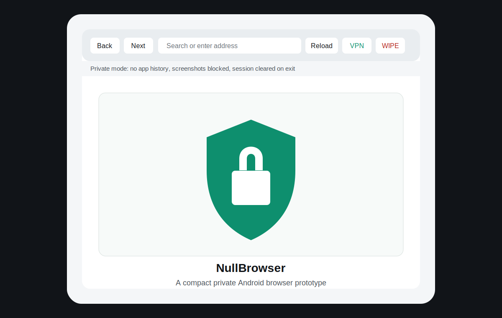
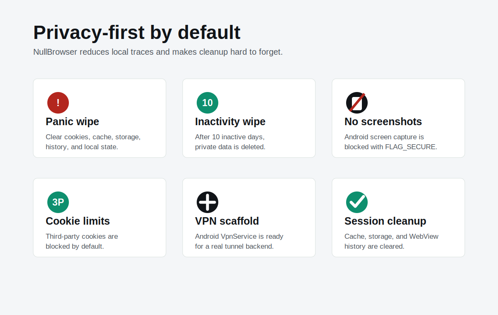

# NullBrowser

I am working on a browser that's null: minimal, private-by-default, and intentionally small.

NullBrowser is a privacy-first Android browser prototype built with native Android `WebView`. It is intentionally small: one Android app module, Java source, no third-party app dependencies, and a direct build path to a debug APK.

The project started as an experiment in building a browser that behaves more like an always-private session than a normal mobile browser. It does not try to replace Chromium or build a browser engine from scratch. Instead, it uses Android's system WebView and hardens the app around it.

## Pictures

Real Android screenshots are intentionally blocked by `FLAG_SECURE`, which is part of the app's privacy behavior. The images below are repository mockups/feature visuals for README and project presentation.





## Project status

Current version: `0.1.0`

Current package name:

```text
com.nullbrowser.privacy
```

Current APK output:

```text
app/build/outputs/apk/debug/app-debug.apk
```

This is a debug build. It is suitable for development, USB installs, and testing on a personal device. A Play Store or public release build would need a release keystore, stronger integrity checks, a privacy policy, and more testing.

## Implemented features

- Native Android browser shell.
- WebView-based browsing.
- Address/search bar.
- Back, forward, and reload controls.
- Manual panic wipe button.
- VPN permission button and `VpnService` scaffold.
- URL normalization for typed domains.
- DuckDuckGo search fallback for non-URL input.
- HTTP and HTTPS browsing only; other URL schemes are blocked.
- Screenshot and screen recording prevention through `FLAG_SECURE`.
- Android backup disabled with `android:allowBackup="false"`.
- Cleartext traffic disabled with `android:usesCleartextTraffic="false"`.
- Third-party cookies blocked.
- WebView form saving disabled.
- WebView file and content access disabled.
- WebView geolocation disabled.
- Mixed content blocked.
- Media autoplay restricted.
- WebView history cleared after each page load.
- Local cache, cookies, form data, and WebView storage cleared on app destroy.
- Automatic private data wipe after 10 days of inactivity.
- Debugger detection that triggers a panic wipe.
- Basic rooted-device signal warning.
- Debug APK build script for Windows.

## Privacy model

NullBrowser currently behaves like a private browsing session with aggressive cleanup. It is designed to reduce local traces inside the app's own storage and WebView session.

Important local privacy controls:

- The app does not maintain its own history database.
- WebView navigation history is cleared after page loads.
- Session data is cleared when the activity is destroyed.
- Cookies are removed during cleanup.
- Web storage is deleted during cleanup.
- The last active timestamp is used only to decide when the 10-day inactivity wipe should run.
- Screenshots and screen recording are blocked at the Android window level.

Important limits:

- Android WebView is still the rendering engine.
- The app cannot guarantee that the Android OS, keyboard app, ISP, websites, or network operator collect no metadata.
- DuckDuckGo is currently used as the default home/search provider.
- No VPN traffic routing exists yet.
- No browser can make someone completely untraceable.
- Website fingerprinting is not fully blocked yet.
- Download handling is not implemented yet.

## Panic wipe behavior

The panic wipe clears private browser state immediately.

It currently clears:

- WebView cache.
- WebView history.
- WebView form data.
- Cookies.
- Web storage.
- Local privacy preferences.

The panic wipe is triggered by:

- Pressing the `WIPE` button and confirming.
- Debugger detection during runtime.
- The 10-day inactivity cleanup path.

This is not destructive to the phone. It does not delete files outside the app's own data/session surface.

## Ten-day inactivity wipe

The app stores a timestamp when it pauses. On the next open/resume, it compares that timestamp to the current time.

If at least 10 days have passed, it wipes private app/browser state.

The constant is defined in:

```text
app/src/main/java/com/nullbrowser/privacy/MainActivity.java
```

```java
private static final long TEN_DAYS_MS = 10L * 24L * 60L * 60L * 1000L;
```

## VPN status

The project includes an Android `VpnService` declaration and a `PrivacyVpnService` class. This means the app has the correct Android-side anchor for a real in-app VPN later.

Current behavior:

- Pressing `VPN` requests/prepares Android VPN permission.
- No traffic tunnel is started yet.
- No VPN server is configured yet.

A real VPN requires one of these:

- A WireGuard-compatible tunnel implementation plus a WireGuard endpoint.
- An OpenVPN-compatible implementation plus an OpenVPN server.
- A custom encrypted proxy and server.
- A trusted external VPN provider integration.

An APK alone cannot hide location or route traffic privately without a backend endpoint. The server or provider choice is part of the security model.

## Architecture

The app is intentionally compact.

Key files:

```text
app/src/main/AndroidManifest.xml
app/src/main/java/com/nullbrowser/privacy/MainActivity.java
app/src/main/java/com/nullbrowser/privacy/PrivacyVpnService.java
app/src/main/java/com/nullbrowser/privacy/RootSignals.java
app/src/main/res/values/styles.xml
app/src/main/res/values/colors.xml
app/src/main/res/values/strings.xml
app/src/main/res/drawable/ic_launcher_foreground.xml
```

### MainActivity

`MainActivity` owns the browser UI, WebView settings, navigation, panic wipe, inactivity wipe, runtime risk checks, and VPN permission preparation.

Main responsibilities:

- Build the UI programmatically.
- Configure privacy-sensitive WebView settings.
- Normalize typed input into URLs or search queries.
- Clear session data.
- Handle back navigation.
- Detect basic debugger/root signals.

### PrivacyVpnService

`PrivacyVpnService` is currently a scaffold. It exists so Android recognizes the app as capable of owning a VPN session after user approval.

Future work belongs here or in helper classes:

- Tunnel lifecycle.
- Foreground service notification.
- Packet routing.
- Server config loading.
- Kill switch behavior.

### RootSignals

`RootSignals` performs very basic rooted-device signal checks:

- Known `su` binary paths.
- Android build tags containing `test-keys`.

This is not strong anti-tamper. It is an early warning surface.

## Build requirements

Known working setup:

- Windows.
- Android Studio installed.
- Android Studio bundled JBR.
- Android SDK Platform 35.
- Android SDK Build-Tools 35.
- Gradle wrapper 8.13.
- Android Gradle Plugin 8.11.1.

The project includes:

```text
gradlew
gradlew.bat
gradle/wrapper/gradle-wrapper.jar
gradle/wrapper/gradle-wrapper.properties
build-apk.ps1
```

`build-apk.ps1` sets `JAVA_HOME` to Android Studio's bundled Java runtime and then calls Gradle.

## Build the APK

From the project root:

```powershell
.\build-apk.ps1
```

That runs:

```powershell
.\gradlew.bat assembleDebug
```

APK output:

```text
app\build\outputs\apk\debug\app-debug.apk
```

## Install on a connected Android phone

Enable Developer Options on the phone:

1. Open Android Settings.
2. Go to About phone.
3. Tap Build number seven times.
4. Open Developer options.
5. Enable USB debugging.
6. Connect the phone with USB.
7. Accept the "Allow USB debugging?" prompt.

Then run:

```powershell
.\build-apk.ps1 installDebug
```

If the device says `UNAUTHORIZED`, unlock the phone and approve the USB debugging prompt. If no prompt appears, revoke USB debugging authorizations, unplug/replug USB, and try again.

## Launch from ADB

If `adb.exe` is available:

```powershell
& "$env:LOCALAPPDATA\Android\Sdk\platform-tools\adb.exe" shell am start -n com.nullbrowser.privacy/.MainActivity
```

Check whether the app process is running:

```powershell
& "$env:LOCALAPPDATA\Android\Sdk\platform-tools\adb.exe" shell pidof com.nullbrowser.privacy
```

Inspect recent logs:

```powershell
& "$env:LOCALAPPDATA\Android\Sdk\platform-tools\adb.exe" logcat -d -t 200
```

## Run from Android Studio

1. Open this folder in Android Studio.
2. Let Gradle sync.
3. Connect a phone or start an emulator.
4. Choose the `app` run configuration.
5. Press Run.

## Development workflow

Useful commands:

```powershell
.\build-apk.ps1
.\build-apk.ps1 installDebug
.\build-apk.ps1 clean
```

For a quick source search:

```powershell
rg "panicWipe|clearSessionData|prepareVpn|normalizeAddress" app/src/main
```

## Security roadmap

High-priority next steps:

- Make the app fully blank-by-default instead of opening DuckDuckGo on launch.
- Add a setting for search provider or disable search fallback entirely.
- Add PIN unlock.
- Add biometric unlock.
- Add automatic wipe after failed unlock attempts.
- Add a true foreground VPN tunnel.
- Add a VPN kill switch.
- Add stronger certificate and backend pinning once a VPN/proxy backend exists.
- Add release signing and signature self-checks.
- Add stricter anti-debug and anti-tamper checks for release builds.
- Add tracker and fingerprinting blocklists.
- Add download handling with private cleanup rules.
- Add automated tests for cleanup behavior.

## Release roadmap

Before publishing or sharing widely:

- Create a release keystore.
- Build a signed release APK or AAB.
- Remove debug-only assumptions.
- Audit WebView settings.
- Add a privacy policy.
- Add a clear threat model.
- Test on multiple Android versions.
- Test cold start, rotation, process death, and low-memory behavior.
- Test USB install, direct APK install, and Android Studio install.

## Threat model notes

NullBrowser is trying to reduce local browsing traces and make privacy defaults harder to forget.

It does not currently defend against:

- A compromised Android OS.
- A malicious keyboard.
- A malicious VPN server.
- Browser engine vulnerabilities in Android WebView.
- Advanced website fingerprinting.
- Cellular provider metadata collection.
- Physical device compromise while unlocked.

These are solvable only partially, and each requires a more explicit security design.

## Git hygiene

The repository ignores:

- Build output.
- APK/AAB artifacts.
- `.gradle`.
- `.idea`.
- `local.properties`.
- OS noise files.

Debug APKs should be rebuilt locally instead of committed.

## License

Adithiyaaaaaaa/nullbrowser- is licensed under the
GNU General Public License v2.0

check more on lICENSE.md

